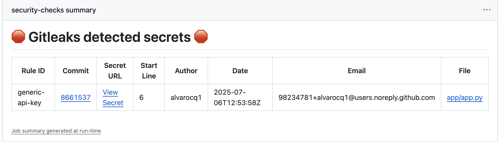

# 🚀 Phase 1: Local CI/CD with GitHub Actions

In this first phase, we explore the basics of **GitHub Actions** by setting up a CI pipeline with **security-focused checks** for a Python application.

### 🛠️ What We Did

We created a `.yml` workflow file — the standard format recognized by GitHub to define CI/CD pipelines. This file describes the steps GitHub should execute when code is pushed or a pull request is created.

We used two key **security tools**:
- **Bandit** → Performs **SAST** (Static Application Security Testing) on Python source code.
- **Gitleaks** → Scans the repository for **hardcoded secrets** or credentials.

These tools run inside an Ubuntu-based runner provided by GitHub.

### ⚙️ Workflow Overview

The workflow includes the following steps:
1. **Checkout the repository** → This step clones the repository code into the GitHub Actions runner, so the pipeline can access and work with the project files.
2. Set up Python 3.10.
3. Install Python dependencies from `requirements.txt`.
4. Run **Bandit** to detect vulnerabilities in the Python source code (`app/`).
5. Run **Gitleaks** to detect hardcoded secrets.
6. Upload the scan results as GitHub Actions artifacts.

This pipeline runs automatically on:
- Every `push` to the `main` branch.
- Every `pull_request` targeting `main`.

---

### ✅ Technologies Used

| Tool            | Purpose                         |
|------------------|----------------------------------|
| GitHub Actions   | CI/CD runner                    |
| Bandit           | Static code analysis (SAST)     |
| Gitleaks         | Secret detection                |
| Python 3.10      | Application runtime             |

---

### 🚨 Results

Below, Gitleaks detects hardcoded secrets in the repository:



Additionally, Bandit identifies a **high-severity vulnerability**:

```bash
Test results:
>> Issue: [B201:flask_debug_true] A Flask app appears to be run with debug=True, which exposes the Werkzeug debugger and allows the execution of arbitrary code.
   Severity: High   Confidence: Medium
   CWE: CWE-94 (https://cwe.mitre.org/data/definitions/94.html)
   More Info: https://bandit.readthedocs.io/en/1.8.6/plugins/b201_flask_debug_true.html
   Location: app/app.py:10:4
9	if __name__ == '__main__':
10	    app.run(debug=True)
```