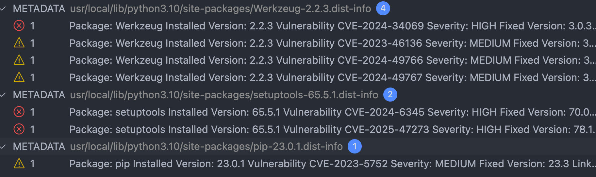

## 🐳 Phase 2: Docker Build and Image Vulnerability Scanning

In this phase, we take a further step in securing our DevSecOps pipeline by:

- Packaging our Python application using **Docker**.
- Building the container image automatically on each push/pull request.
- Scanning the resulting image with **Trivy** for known vulnerabilities (CVEs).

---

### 📦 What We Did

We created a `Dockerfile` to define how our Python app should be containerized. The Dockerfile includes:

- Setting up the base image (`python:3.10-slim`)
- Copying the application files to the container
- Installing Python dependencies
- Exposing the correct port
- Running the app with Flask

Once the image is built in the CI pipeline, we scan it with **Trivy**, which performs a vulnerability assessment on OS packages and installed dependencies.

---

### ⚙️ CI Workflow Overview

The new **GitHub Actions job** added in this phase performs the following:

1. Checks out the repository.
2. Sets up Docker Buildx for multi-platform builds.
3. Builds the Docker image from the `Dockerfile`.
4. Scans the image using Trivy:
   - Detects known vulnerabilities (CVEs)
   - Fails the pipeline if critical issues are found
5. Uploads the scan results as a downloadable artifact.

This job is triggered automatically on:
- Every `push` to the `main` branch.
- Every `pull_request` to `main`.

---

### 🔧 Technologies Used

| Tool           | Purpose                             |
|----------------|--------------------------------------|
| Docker         | Containerization of the application  |
| GitHub Actions | CI/CD orchestration                  |
| Trivy          | Image vulnerability scanner (SCA)    |
| Buildx         | Advanced Docker builder              |

---

### 🔍 Trivy Scan Result Example

The following image shows an example of a **Trivy report**, identifying several CVEs in the base image or installed libraries:

