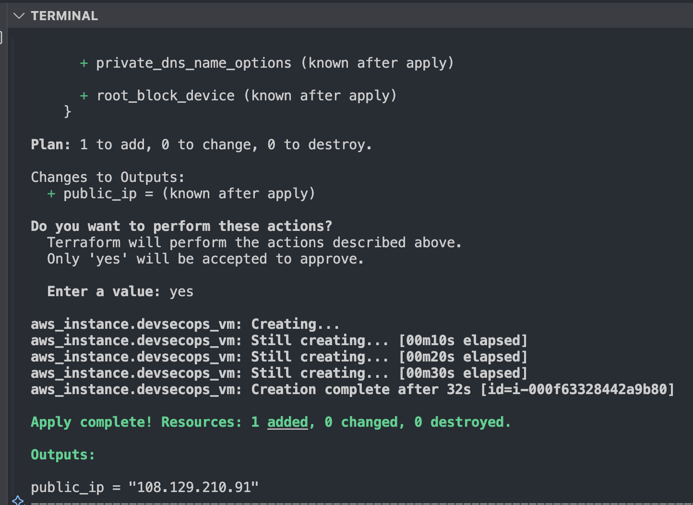
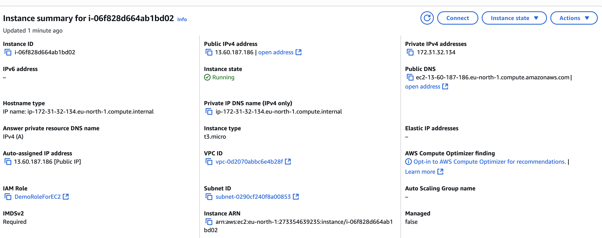
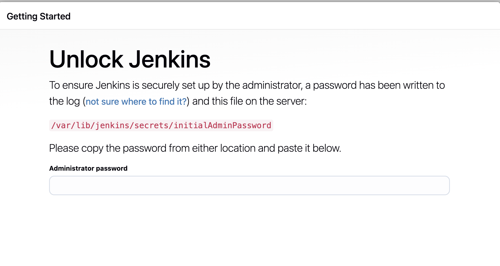
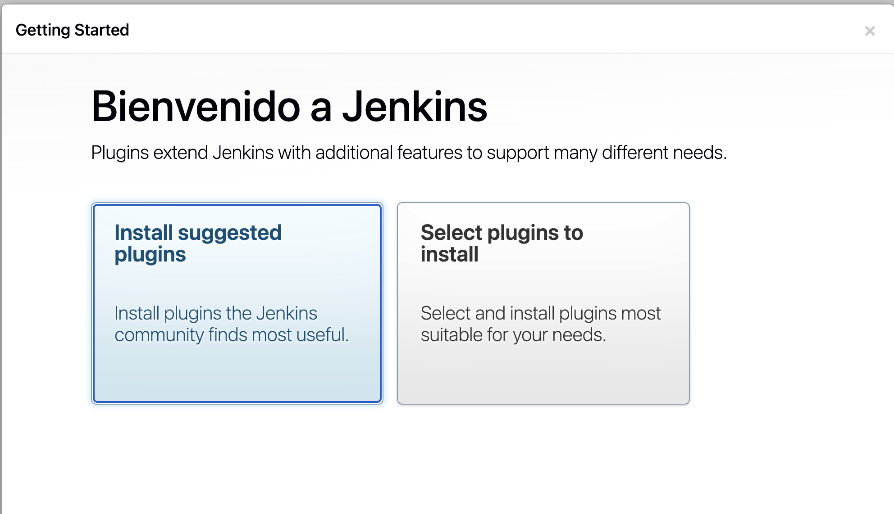
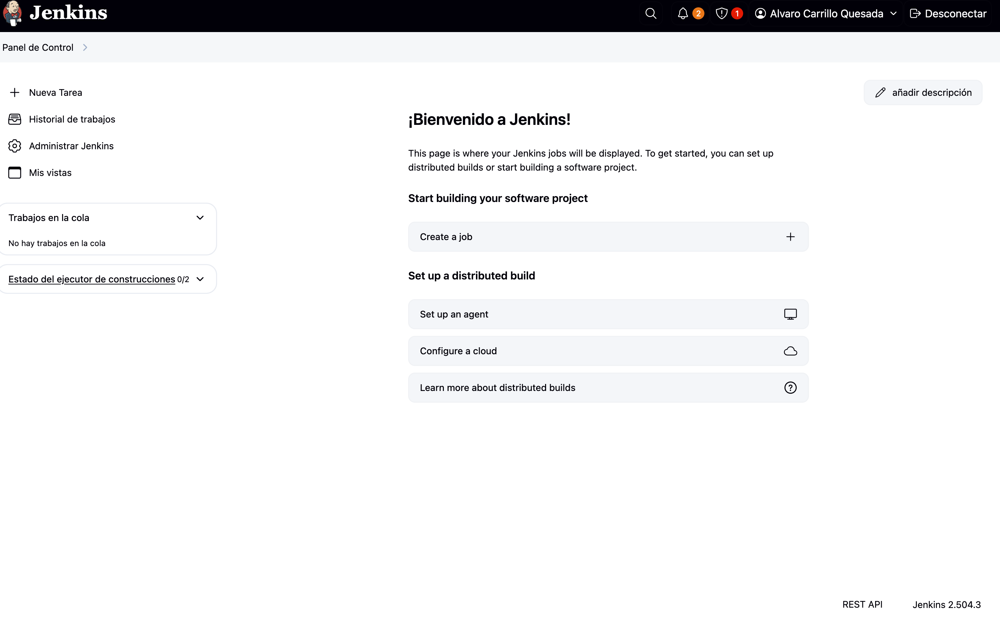

## 🧱 Phase 3 – Jenkins Deployment on AWS with Terraform

This phase of the project consists of automatically deploying an EC2 instance on AWS using Terraform and configuring a functional Jenkins server on it. The goal is to have a minimal CI/CD infrastructure managed as code.

---

### 🛠️ Technologies Used

* **Terraform**: IaC (Infrastructure as Code) to define and provision the EC2 instance.
* **AWS EC2**: Virtual machine that will host Jenkins.
* **Amazon Linux 2023 + Jenkins LTS**
* **SSH Key + Security Group**: to control external access (ports 22 and 8080)

---

### 📁 File Structure

```
devsecops-pipeline-complete/
├── main.tf
├── outputs.tf
├── variables.tf
├── terraform.tfstate
├── .terraform/
```

---

### 🚀 Deployment Process

1. **Terraform Initialization**

   ```bash
   terraform init
   ```

2. **Planning and Applying**

   ```bash
   terraform plan
   terraform apply
   ```

   ✅ Once applied, Terraform launches a `t2.micro` EC2 instance and returns its public IP.

   

3. **Viewing in the AWS Console**

   The `devsecops-jenkins` instance appears as active with a `running` state in EC2.

   

4. **Accessing Jenkins via Browser**

   Open the public IP in your browser at `http://<ip>:8080`.

   The first screen prompts you to enter the administrator password:

   

   To retrieve it:

   ```bash
   sudo cat /var/lib/jenkins/secrets/initialAdminPassword
   ```

5. **Installing Jenkins and Java**

   To enable Jenkins, it was necessary to manually install **Java 17** and add the official Jenkins repository before proceeding with the installation.

6. **Installing Recommended Plugins and Creating the Admin User**

   Jenkins suggests installing the most commonly used plugins:

   

   After that, an admin user is created.

7. **Jenkins Dashboard View**

   Once the initial configuration is complete, the Jenkins dashboard is displayed:

   

---
